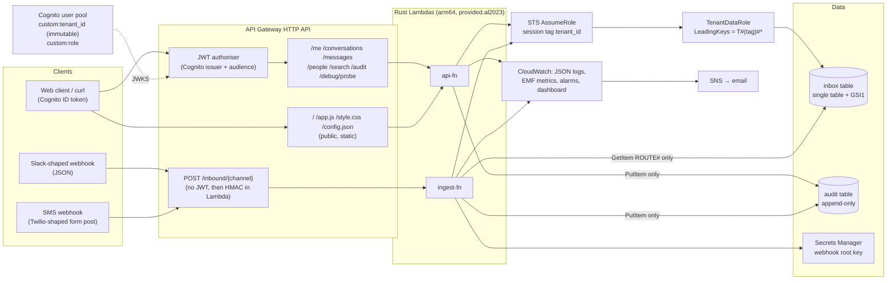
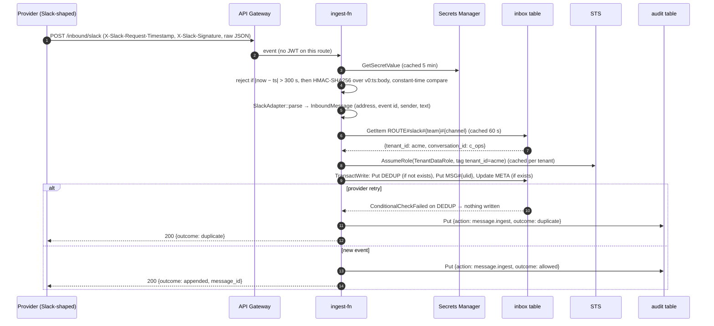
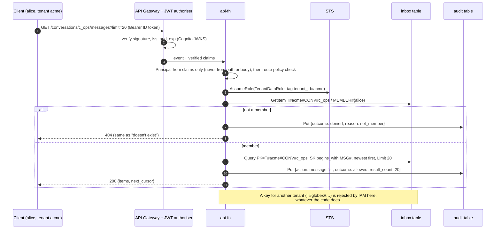

# Architecture

A multi-tenant messaging backend: messages arrive from different channels in different wire
formats, are translated into one canonical message, routed to a tenant's conversation, and read
back through a JWT-protected API and a small web client. Rust on AWS Lambda, API Gateway HTTP API,
DynamoDB, Cognito, CDK (TypeScript). Region `ap-southeast-2`.

The central claim: **tenant isolation is enforced by IAM, not only by application code.** Each
request runs with short-lived STS credentials tagged with the caller's tenant, and IAM only lets
those credentials touch DynamoDB keys under `T#<tenant>#`. A deliberately unsafe probe endpoint
skips every application check and reads another tenant's data; DynamoDB refuses it.

This is a time-boxed demo, so some things are designed but not built. They are marked as such.

- [Components](#components)
- [Request flows](#request-flows)
- [Tenant isolation](#tenant-isolation)
- [Data model](#data-model)
- [Channel adapters](#channel-adapters)
- [Security](#security)
- [Audit log](#audit-log)
- [Observability](#observability)
- [Search](#search)
- [Build, test and deploy](#build-test-and-deploy)
- [Trade-offs and next steps](#trade-offs-and-next-steps)

---

## Components



**Two Lambdas, split by IAM blast radius rather than by route.**

- `api-fn` serves every authenticated route through an internal router, plus the web client's
  static files. Its role has no DynamoDB access to the inbox table at all: it can assume the
  tenant-scoped role, and append to the audit table.
- `ingest-fn` is unauthenticated at the edge, so it gets the smallest role that works: read the
  webhook secret, read `ROUTE#` records (the one deliberate cross-tenant read, content-free), assume
  the tenant-scoped role, append to the audit table.

Every route is declared explicitly in API Gateway; there is no catch-all, so an unknown path never
reaches a Lambda.

## Request flows

### Inbound message



The tenant comes only from the `ROUTE#` record, never from anything in the payload. Unknown
addresses are accepted and dropped (with an `UnroutedMessage` metric) so providers don't retry
forever. Bot messages and edits are acknowledged and ignored.

### Authenticated read



The pipeline for every authenticated route is the same: claims → principal → role check →
tenant-scoped client → handler → audit record → response. If the audit record can't be written,
the response is a 500 with no data.

## Tenant isolation

Three layers, each of which would stop a cross-tenant read on its own.

**1. Key design.** Every tenant-owned partition key starts with `T#<tenant_id>#`. The trailing `#`
matters: it stops tenant `acme` matching `acme2` under the IAM pattern `T#acme#*`. Tenant ids are
validated as `[a-z0-9-]{3,32}`, and every other id that ends up in a key (conversation, user,
provider ids) is validated to exclude `#` and `*`, so input can't break a key or act as a wildcard.

**2. Types.** A `Principal` is built only from verified JWT claims. Repository methods take a
`TenantScope`, which has no public constructor: it comes from a `Principal`, or for ingest from a
tenant resolved via a route record. Key strings are built in one module (`store::keys`); handlers
never format a key. The operator-only constructor used by the seed tool is behind a cargo feature
that the Lambda binaries don't enable, so it doesn't exist in them.

**3. IAM, per request.** Each request assumes `TenantDataRole` with a `tenant_id` session tag:

```jsonc
// trust policy: both actions require exactly one tag, tenant_id
{ "Effect": "Allow",
  "Principal": { "AWS": ["<api-fn role>", "<ingest-fn role>"] },
  "Action": ["sts:AssumeRole", "sts:TagSession"],
  "Condition": {
    "StringLike": { "aws:RequestTag/tenant_id": "?*" },
    "ForAllValues:StringEquals": { "aws:TagKeys": ["tenant_id"] } } }

// permissions (inbox table and GSI1); the audit table gets Query only, same condition
{ "Effect": "Allow",
  "Action": ["dynamodb:GetItem", "dynamodb:BatchGetItem", "dynamodb:Query",
             "dynamodb:PutItem", "dynamodb:UpdateItem", "dynamodb:ConditionCheckItem"],
  "Resource": ["<inbox>", "<inbox>/index/GSI1"],
  "Condition": { "ForAllValues:StringLike": {
    "dynamodb:LeadingKeys": ["T#${aws:PrincipalTag/tenant_id}#*"] } } }
```

Details that matter:

- **The action list is explicit, with no `Scan`.** `ForAllValues` evaluates to true when the key
  is absent, and a Scan carries no leading keys, so `dynamodb:*` with this condition would allow a
  cross-tenant Scan.
- `TransactWriteItems` is authorised per underlying action, so the condition applies to every item
  in a transaction.
- GSI1's partition keys are tenant-prefixed too, so the condition holds whichever way the index is
  queried.
- STS credentials are cached per tenant for 14 minutes (sessions last 15), so AssumeRole isn't on
  every request's path.

**The probe.** `GET /debug/probe?tenant=<other>` (behind a flag) builds `T#<other>#TENANT` with the
caller's scoped client, skipping every application check. DynamoDB returns `AccessDeniedException`,
the API returns `{"blocked_by": "iam"}`, and the audit log records `denied_by_iam`. If the read ever
succeeded, the endpoint returns a 500, emits an `IsolationBreach` metric and logs an error.

## Data model

Access patterns first, keys second.

| # | Access pattern | Operation | Key condition |
|---|---|---|---|
| AP1 | Inbound address → tenant + conversation | GetItem | `ROUTE#<ch>#<addr>` |
| AP2 | External sender → internal user | GetItem | `T#t#IDENT#<ch>#<ext_id>` |
| AP3 | Idempotent ingest | TransactWrite (conditional put) | `T#t#DEDUP#<ch>#<ext_id>` |
| AP4 | Append a message | Put in the same transaction | `T#t#CONV#c`, `MSG#<ulid>` |
| AP5 | Page messages, newest first | Query | `T#t#CONV#c`, `begins_with MSG#`, reverse |
| AP6 | Is user U in conversation C? | GetItem | `T#t#CONV#c`, `MEMBER#u` |
| AP7 | Conversation members | Query | `T#t#CONV#c`, `begins_with MEMBER#` |
| AP8 | A user's conversations | Query GSI1 | `GSI1PK = T#t#USER#u` |
| AP9 | People I share conversations with | AP8, then AP7 per conversation | see below |
| AP10 | Users in a tenant | Query | `T#t#TENANT`, `begins_with USER#` |
| AP12 | A tenant's audit trail for a day | Query (audit table) | `T#t#AUDIT#<yyyy-mm-dd>` |
| AP13 | What did actor X do? | Query (audit GSI1) | `T#t#ACTOR#<sub>` |

Example items in the `inbox` table:

| PK | SK | GSI1PK | GSI1SK | Other attributes |
|---|---|---|---|---|
| `T#acme#TENANT` | `USER#<sub>` | | | `email`, `display_name`, `role` |
| `T#acme#CONV#c_ops` | `META` | `T#acme#CONVS` | `CONV#c_ops` | `name`, `last_message_at` |
| `T#acme#CONV#c_ops` | `MEMBER#<sub>` | `T#acme#USER#<sub>` | `CONV#c_ops` | `joined_at`, `conv_role` |
| `T#acme#CONV#c_ops` | `MSG#01M3P9…` | | | `channel`, `sender`, `body_text`, `sent_at`, … |
| `T#acme#IDENT#slack#U024BE7LH` | `IDENT` | | | `user_id` |
| `T#acme#DEDUP#slack#Ev08MFMKH6` | `DEDUP` | | | `message_id`, `expires_at` (7 days) |
| `ROUTE#slack#T0ACME#C0OPS` | `ROUTE` | | | `tenant_id`, `conversation_id` |

Design notes:

- **A conversation's header, members and messages share one partition.** The membership check is a
  point read in the same partition as the page being read.
- **ULID sort keys** give time order and unique ids in one value. Order is by receive time; the
  provider's `sent_at` is stored separately because email and SMS can arrive out of order.
- **GSI1 is overloaded** with two sparse patterns: the inverted membership edge (AP8) and the
  tenant's conversation list. That's cheap now, and the first thing to split if their traffic
  profiles diverge, because one hot pattern throttles the other and a throttled GSI back-pressures
  base-table writes.
- **Cursors** are the base64url `LastEvaluatedKey`. On the way back in, the cursor's partition key
  must equal the partition being paged and its sort key must have the expected prefix, so a
  crafted cursor can't move to another conversation. (IAM would reject another tenant's key
  anyway.)
- **`last_message_at`** is one update on the conversation header per message, not a fan-out to
  every member. "My conversations by recent activity" is AP8, then a BatchGet of the headers.
- **Relationships (AP9)** are an adjacency list: membership is stored once and projected inverted
  into GSI1. "People I share conversations with" is 1 + N queries, eight in flight at a time. At
  scale, a stream consumer would materialise `PEER#` edges so it becomes one Query, at the cost of
  write amplification on large conversations.

The `audit` table is separate on purpose: its own IAM (append-only), retention (TTL at 90 days),
backups and, later, archive stream, and a bug in data-path code can't touch it.

## Channel adapters

```rust
pub trait ChannelAdapter: Send + Sync {
    fn channel(&self) -> Channel;
    /// Header names carrying the timestamp and the `v0=` signature.
    fn signature_headers(&self) -> (&'static str, &'static str);
    fn parse(&self, body: &[u8], now: OffsetDateTime) -> Result<Inbound, ParseError>;
}

pub enum Inbound {
    Message(InboundMessage),                 // address, external_id, sender, text, sent_at
    UrlVerification { challenge: String },   // Slack's endpoint handshake
    Ignored { reason: &'static str },        // bot posts, edits, other event types
}
```

- **Slack**: the Events API envelope (JSON). Routed on team + channel; de-duplicated on
  `event_id`, because Slack retries with the same id. `url_verification` is answered; messages
  with a subtype (bots, edits, joins) are ignored.
- **SMS**: a Twilio-shaped `application/x-www-form-urlencoded` post. Routed on the `To` number;
  de-duplicated on `MessageSid`. The different wire format is the point.
- Both become the same `CanonicalMessage`: a ULID, the conversation, the channel, a sender
  (a linked internal user, or an external address), the text, and both timestamps. Native posts from
  the API go through the same append path.

Adding a channel means one parser and one route record; routing, idempotency, isolation and audit
are shared.

## Security

**Authentication.**

- Cognito user pool (Lite tier) with email sign-in and no self sign-up. `custom:tenant_id` is
  immutable, and the app client can't write custom attributes, so users can't change their own
  tenant or role.
- API Gateway's JWT authoriser checks signature, issuer, audience and expiry before a Lambda runs.
- Demo shortcut: the client sends the **ID token**, because custom attributes appear there on the
  Lite tier. In production: access tokens with the tenant and role injected by a pre-token-generation
  trigger, OAuth scopes per route, MFA, and federation to the customer's identity provider.
- Sign-in is `USER_PASSWORD_AUTH`. In production it would be SRP or the hosted UI with PKCE.

**Authorisation.** One route table in code maps each route key to its handler, required role and
audit action, so the whole policy can be reviewed in one place. Tests check that every non-public
route is audited and that the audit log is admin-only.

| Check | Where | Failure |
|---|---|---|
| Valid token | API Gateway authoriser | 401 (API Gateway access log) |
| Role in tenant (`/audit` needs admin) | route table | 403, audited |
| Conversation membership | point read (AP6), never cached | 404, audited as `denied` |
| Tenant scope | IAM `LeadingKeys` via session tag | 404, audited as `denied_by_iam` |

Error bodies are a short code (`{"error": "not_found"}`) with no internal detail; the detail goes
to the audit record and the logs.

**Webhooks.** HMAC-SHA256 over `v0:<timestamp>:<raw body>`, sent as `v0=<hex>` (Slack's scheme,
used for the SMS channel too in this demo; real Twilio signs differently). The timestamp window
(±300 s) is checked before the HMAC, and the comparison is constant-time. Keys are per channel,
derived as `HMAC-SHA256(root, "webhook/<channel>")` from one generated root secret in Secrets
Manager, so a payload signed with the Slack key is rejected on the SMS route.

**Least privilege.**

| Principal | Allowed | Not allowed |
|---|---|---|
| `api-fn` role | AssumeRole + TagSession on TenantDataRole; PutItem on `audit` | any `inbox` access; Scan; secrets |
| `ingest-fn` role | GetItem on `inbox` with `LeadingKeys = ROUTE#*`; AssumeRole + TagSession; PutItem on `audit`; read one secret | Query, Scan, any tenant key |
| `TenantDataRole` | Get/BatchGet/Query/Put/Update/ConditionCheck on `inbox` + GSI1, Query on `audit`, all under `T#<tag>#*` | Scan, Delete, anything untagged |
| everyone | | Update, Delete, BatchWrite or PartiQL writes on `audit` (table resource policy) |

**Web client.** Vanilla JavaScript served by `api-fn` from the API's own origin (no CORS). A strict
Content-Security-Policy allows scripts and styles from `'self'` only and network calls to the API
and Cognito. All data is rendered with `textContent`; there is no `innerHTML`. Message bodies are
capped at 1,000 characters, and the API stage is throttled (50 rps, 20 rps on `/inbound`).

**Supply chain.** GitHub Actions pinned to commit SHAs, `cargo deny` (advisories, licences,
sources), gitleaks in CI and as a pre-commit hook. The AWS SDK is built on its current HTTPS client
rather than the legacy rustls 0.21 stack, which removes several advisories from the tree.

## Audit log

Every read or write of tenant data, and every denial, produces one record:

```json
{
  "event_id": "01M3P…", "ts": "2026-09-30T09:15:02.123Z",
  "tenant_id": "acme",
  "actor": { "type": "user", "sub": "…", "username": "alice@acme.test", "role_at_time": "admin",
             "groups": [], "source_ip": "203.0.113.4", "user_agent": "…" },
  "action": "message.list",
  "resource": { "type": "conversation", "id": "c_ops" },
  "outcome": "allowed",
  "reason": null,
  "result_count": 20,
  "request": { "api_request_id": "…", "lambda_request_id": "…",
               "route": "GET /conversations/{id}/messages", "params_hash": "sha256:…" },
  "service": { "fn": "api-fn", "version": "<git sha>" },
  "record_hash": "sha256:…"
}
```

- `action` is a closed set; `outcome` is one of `allowed`, `denied`, `denied_by_iam`, `error`,
  `duplicate`. Integrations appear as actor type `integration:slack` or `integration:sms`.
- Query parameters are stored as a hash, never as values, and message bodies never appear.
- `record_hash` is SHA-256 over the canonical JSON of the rest of the record.
- **Append-only.** Records are written with `attribute_not_exists(PK)` by each function's own role,
  which can only `PutItem`. A table resource policy denies updates and deletes to every principal,
  including administrators. Tenant admins read their own tenant's trail through the tenant-scoped
  role, and that read is itself audited.
- **Fail-closed.** For reads, the record is written after the data is fetched and before the
  response is sent; if it fails, the caller gets a 500 and no data, and an `AuditWriteFailed`
  metric raises a P1 alarm.
- **Known gap.** For writes, the message is stored before its audit record. If the audit write
  fails, the provider receives a 500 and retries, and the retry is audited as a duplicate, so the
  event still reaches the trail. The complete fix is a single cross-table `TransactWriteItems`
  covering both.

Path to compliance: next, stream the audit table to S3 with Object Lock and a hash-chained digest
per batch (modelled on CloudTrail log-file validation); in production, a separate log-archive
account in compliance mode, service control policies against changes, SIEM export, and multi-year
retention with periodic chain verification.

## Observability

- **Logs.** JSON through `tracing`, with Lambda's JSON log format. Every request line carries
  `tenant_id`, `route`, `api_request_id`, `outcome`, status and latency, plus the Lambda request id
  and X-Ray trace id. No message bodies or tokens are logged.
- **Metrics** via Embedded Metric Format (log lines, no `PutMetricData` calls): `AuditWritten`,
  `AuditWriteFailed`, `AuthzDenied` (total and by reason), `MessagesIngested` and
  `DuplicateDelivery` (by channel), `WebhookRejected` (by channel and reason), `UnroutedMessage`,
  `StsCacheMiss`, `IsolationBreach`.
- **Alarms → SNS email.** Audit write failure (P1), errors on each Lambda, API 5xx rate above 1%,
  Lambda throttles, DynamoDB throttling on either table, and a spike in authorisation denials
  (possible probing).
- **Dashboard.** Requests, errors, p50/p99 latency, ingest by channel, denials and audit writes,
  Lambda duration, alarm status, and a table of denials by tenant and route.
- **Saved Logs Insights queries.** `corro-demo/request-trace` (one request across both Lambdas and
  the API access log), `corro-demo/denials-by-tenant`, `corro-demo/cold-starts`.
- **Drill.** Pointing `api-fn` at a missing audit table made the next request fail closed with a
  500, and the P1 alarm fired about a minute later; restoring the setting cleared it.
- Measured cold starts: about 115 ms for `api-fn` and 190 ms for `ingest-fn` (Rust, arm64,
  256 MB), including loading the AWS SDK configuration.

## Search

`/search` goes through a `MessageSearch` trait. The built implementation, `DdbScanFallback`, reads
the latest 50 messages of each of the caller's conversations and does a case-insensitive substring
match. It only ever sees the caller's own conversations, in the caller's tenant, but it only covers
recent messages and doesn't scale.

**Designed, not built: OpenSearch** behind the same trait, so `/search` wouldn't change.

- One shared index (`messages-v1` behind an alias) with `_routing = tenant_id`, fed from the table's
  stream by an indexer Lambda (filtered to `MSG#` inserts and removes, bisect on error, a DLQ,
  message id as the document id so replays are idempotent).
- Queries are built only from a `TenantScope` and always filter on the tenant **and** the caller's
  conversation ids; tenant filtering alone would let a user find messages in conversations they
  aren't in.
- Index-per-tenant gives stronger isolation and provable offboarding but multiplies shards; for a
  mixed customer base I'd use a tiered model: a shared index by default, and dedicated indexes or
  domains for tenants whose accreditation requires it.
- Sizing: a single `t3.small.search` domain (about US$1.40 a day) is enough for a demo; OpenSearch
  Serverless has a minimum of about US$6.70 a day.

## Build, test and deploy

```
services/   Rust workspace
  crates/domain     validated ids, Principal, TenantScope, CanonicalMessage
  crates/store      key builders, STS credentials cache, InboxRepo, audit writer/reader, routes
  crates/adapters   HMAC verification, Slack and SMS adapters
  crates/search     MessageSearch trait, DynamoDB fallback
  bins/api          route table, request pipeline, handlers, web client
  bins/ingest       webhook pipeline
  bins/seed         operator tool: Cognito users and demo data
  web/              index.html, app.js, style.css (embedded into api-fn)
infra/      CDK app, one stack (CorroDemo)
scripts/    login, demo, smoke, reset, sign-webhook, teardown
fixtures/   webhook payloads shared by tests and scripts
```

- **Tests.** Unit tests for ids, claims, keys, cursors, signatures and adapters. Repository and
  full request-pipeline tests run against DynamoDB Local with API-Gateway-shaped events and fake
  verified claims: dedup, fail-closed audit, audited 403s, tampered cursors, two tenants with the
  same conversation id, and the probe reporting a breach when nothing blocks it. DynamoDB Local has
  no IAM, so the IAM boundary itself is verified against the deployed stack by `scripts/smoke.sh`.
- **CI** (GitHub Actions, no AWS credentials): `cargo fmt`, `clippy -D warnings`, tests with a
  DynamoDB Local service container, `cargo deny`, gitleaks, TypeScript type-check and `cdk synth`.
- **Deploy** is a local `cdk deploy`. `cargo-lambda-cdk` cross-compiles the Rust binaries for
  arm64 during synth. `scripts/smoke.sh` runs the whole demo against the deployed stack with
  assertions, in about ten seconds.
- **Designed, not built: continuous deployment.** The AWS account this runs in has an
  organisation policy that denies creating OIDC identity providers, which rules out GitHub Actions
  deploying via OIDC. Rather than fall back to stored access keys, the design keeps CI in GitHub
  Actions and moves CD into AWS: CodePipeline triggered through a CodeConnections GitHub App, an
  ARM CodeBuild project running `cdk deploy` through the CDK bootstrap roles and then the smoke test,
  with a manual approval gate. No AWS credentials would live in GitHub.

## Trade-offs and next steps

**Pooled, siloed or tiered tenancy.** Everything here is pooled: one table, with IAM `LeadingKeys`
acting as row-level security enforced by AWS. A silo (table or account per tenant) gives
per-tenant backups, per-tenant encryption keys (DynamoDB encryption is per table), clean
offboarding and no noisy neighbours, at the cost of per-tenant migrations and harder fleet-wide
reporting. For customers with differing assurance requirements, a tiered model (pooled by default,
silo where required, same code behind a table resolver) is the realistic answer.

**Hot partitions and noisy neighbours.**

- One very busy conversation: write-shard its message partition and merge on read.
- A very active tenant's daily audit partition: suffix-shard it and query the shards together.
- HTTP APIs only have stage and route throttles, so per-tenant rate limiting would be a token
  bucket (DynamoDB conditional counter or an in-memory store), with the largest tenants moved to
  dedicated compute.
- The account's Lambda concurrency quota is 10, so no reserved concurrency is set; stage throttles
  do the limiting.

**What's cached, and what deliberately isn't.** STS credentials (per tenant, 14 min), route records
(60 s), the webhook root key (5 min) and SDK clients are cached in the warm container. The
membership check is never cached: it's a single-digit-millisecond point read, and cached
authorisation decisions are where stale-permission bugs come from.

**When a graph database would earn its place.** Variable-depth traversals (permissions inherited
through nested groups, "who could have seen this message"), path and community questions, and
relationships that change faster than they can be re-materialised. DynamoDB would stay the system of
record, with the graph fed from the stream. Isolation there is harder: there's no `LeadingKeys`
equivalent, so every traversal needs a mandatory tenant filter, or a graph per high-assurance tenant.

**Next, at real scale.**

- Put SQS between webhook receipt and processing: acknowledge fast, process asynchronously, with
  a DLQ and redrive.
- Write the message and its audit record in one transaction.
- Materialise `PEER#` edges; add OpenSearch behind the existing trait.
- A real-time layer (WebSocket API plus a presence store) instead of polling.
- Access tokens with injected claims, per-tenant keys for silo tenants.
- OpenTelemetry end to end, and a load test with one oversized tenant to prove the noisy-neighbour
  limits.

## Cost and teardown

About US$0.05 a day at demo traffic: Lambda, API Gateway, DynamoDB on-demand and Cognito are within
free-tier or cents, plus one secret and eight alarms. `scripts/teardown.sh` destroys the stack,
force-deletes the secret (so its name can be reused on the next deploy), optionally removes the CDK
bootstrap, and fails if anything tagged `project=corro-demo` remains.
